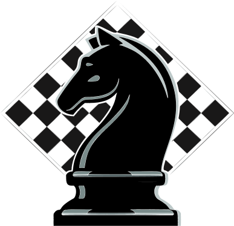

---

# London Chess Club

The website for the London Chess Club.

Live at **[londonchess.ca](https://londonchess.ca)**.

---

## Tech stack

- **Frontend** — Angular (standalone components + signals), NgRx, SCSS, Chart.js, and
  [lichess-pgn-viewer](https://github.com/lichess-org/pgn-viewer) for game replays
- **Backend** — Node + Express REST API, MongoDB via Mongoose, with images in AWS S3
- **Hosting** — AWS (S3 + CloudFront for the site, EC2 for the API)

---

## Project layout

```
london-chess-club/
├─ frontend/   # Angular single-page app
└─ backend/    # Node + Express REST API
```

Each package is self-contained with its own `package.json`. See
[`frontend/README.md`](frontend/README.md) for app-specific details.
